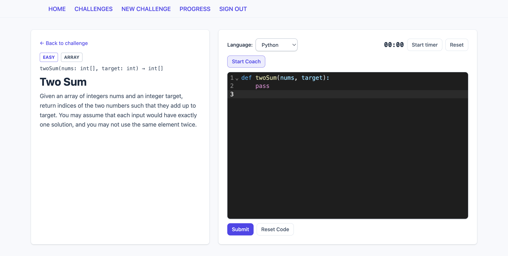

# Code Buddy



Code Buddy is an interactive coding challenge platform where users create, share, and solve programming challenges with real-time code execution, automated test case validation, and AI-powered features. It combines a sandboxed code editor with interview-style coaching tools to help developers sharpen their skills.

## Background

As a developer, I wanted to build a tool that makes practicing coding problems more engaging and personalized. Unlike existing platforms, Code Buddy lets users create their own challenges with custom test cases, track their progress over time, and leverage AI to auto-generate test cases.

## Getting Started

- **Deployed App:** [Code Buddy](https://code-buddy-app.netlify.app)
- **Back-End Repository:** [Code Buddy Back-End](https://github.com/ctrlclos/back-end-code-buddy)

## Features

### Challenge Management
- Create challenges with title, description, difficulty level, and data structure tags
- Define **function-based challenges** with typed parameters and return types (starter code is auto-generated for Python and JavaScript)
- Filter challenges by difficulty, data structure, or curated status and sort by date or difficulty
- Full CRUD — authors can edit and delete their own challenges

### AI-Powered Test Case Generation
- One-click test case generation powered by **Google Gemini**
- Produces five test cases per challenge, covering standard inputs, edge cases, and boundary conditions
- Preview generated test cases before saving individually or all at once
- Supports function-based challenges
- First two test cases are visible to the solver; the rest are hidden

### Code Practice Environment
- **CodeMirror** editor with VS Code Dark theme and syntax highlighting
- Python and JavaScript language switching with auto-generated starter code
- Built-in countdown timer (start, pause, reset) for timed practice
- Submit code and instantly see per-test-case pass/fail results
- Hidden test cases show only pass/fail status — no input/output leakage

### Secure Code Execution
- User code runs in **E2B** Firecracker microVM sandboxes (not Docker) for speed and isolation
- 30-second execution timeout per test case
- Supports both function-call testing (via a generated harness) and raw stdin/stdout testing

### Voice Coach (Interview Simulation)
- Toggle microphone input to simulate a whiteboard interview
- Real-time volume meter powered by the Web Audio API
- Detects silence and displays encouraging coaching nudges after a configurable threshold
- 12 unique interview-coaching prompts with a cooldown to prevent spam
- Nudge counter tracks how often the coach had to intervene

### Progress Tracking
- Dashboard with solved count, solve rate, attempted challenges, and total submissions
- Breakdown by difficulty and by data structure with progress bars
- Recent activity feed with expandable history
- Side-by-side comparison of first versus latest attempt per challenge

## API Endpoints

### Authentication

| Method | Endpoint | Auth | Description |
|--------|----------|------|-------------|
| POST | `/auth/sign-up` | No | Register a new user and receive a JWT |
| POST | `/auth/sign-in` | No | Authenticate and receive a JWT |

### Challenges

| Method | Endpoint | Auth | Description |
|--------|----------|------|-------------|
| GET | `/challenges` | No | List all challenges (supports `difficulty`, `data_structure_type`, `is_curated`, `sort_by` query params) |
| GET | `/challenges/:id` | No | Get a single challenge with starter code |
| POST | `/challenges` | Yes | Create a new challenge |
| PUT | `/challenges/:id` | Yes | Update a challenge (author only) |
| DELETE | `/challenges/:id` | Yes | Delete a challenge (author only) |

### Submissions

| Method | Endpoint | Auth | Description |
|--------|----------|------|-------------|
| POST | `/challenges/:id/submit` | Yes | Submit code — runs against all test cases in a sandbox |
| GET | `/challenges/:id/submissions` | Yes | Get the authenticated user's submissions for a challenge |

### Test Cases

| Method | Endpoint | Auth | Description |
|--------|----------|------|-------------|
| GET | `/challenges/:id/test-cases` | Yes | List test cases for a challenge |
| POST | `/challenges/:id/test-cases` | Yes | Create a test case (author only) |
| PUT | `/test-cases/:id` | Yes | Update a test case (author only) |
| DELETE | `/test-cases/:id` | Yes | Delete a test case (author only) |
| POST | `/challenges/:id/generate-test-cases` | Yes | AI-generate five test cases (author only) |

### Progress

| Method | Endpoint | Auth | Description |
|--------|----------|------|-------------|
| GET | `/progress/stats` | Yes | User stats — solved, attempted, solve rate, breakdowns by difficulty and data structure |
| GET | `/progress/activity` | Yes | Recent submissions feed (supports `limit` query param, default 20) |

## Database Schema

| Table | Key Columns |
|-------|-------------|
| **users** | `id`, `username`, `password` (hashed), `created_at` |
| **coding_challenges** | `id`, `author` (FK), `title`, `description`, `difficulty`, `data_structure_type`, `function_name`, `function_params` (JSONB), `return_type`, `is_curated` |
| **test_cases** | `id`, `challenge_id` (FK), `input`, `expected_output`, `is_hidden` |
| **submissions** | `id`, `user_id` (FK), `challenge_id` (FK), `code`, `language`, `status`, `notes`, `submitted_at` |

## Prerequisites

- **Node.js** (v18+) and **npm**
- **Python** 3.12+ and **pipenv**
- **PostgreSQL** (running locally)
- **E2B API key** — [get one free](https://e2b.dev/dashboard?tab=keys) (required for code execution)
- **Gemini API key** — [get one free](https://aistudio.google.com/apikey) (required for AI test generation)

## Installation

### Setup — Back-End

```bash
cd back-end-code-buddy

# Create a .env file from the example
cp .env.example .env
# Fill in: POSTGRES_DATABASE, POSTGRES_USERNAME, POSTGRES_PASSWORD,
#          JWT_SECRET, E2B_API_KEY, GEMINI_API_KEY

# Install dependencies
pipenv install

# Create the database and apply the schema
createdb your_database_name
psql -d your_database_name -f schema.sql

# Start the server (runs on http://localhost:3000)
pipenv run python app.py
```

### Setup — Front-End

```bash
cd front-end-code-buddy

# Create a .env file
echo "VITE_BACK_END_SERVER_URL=http://localhost:3000" > .env

# Install dependencies
npm install

# Start the dev server (runs on http://localhost:5173)
npm run dev
```

## Technologies Used

| Layer | Technologies |
|-------|-------------|
| **Front-End** | React 19, React Router 7, Tailwind CSS 4, CodeMirror, Vite 7 (SWC) |
| **Back-End** | Python, Flask, PostgreSQL, psycopg2 |
| **Auth** | JWT (PyJWT), bcrypt |
| **Code Execution** | E2B Cloud Sandboxes (Firecracker microVMs) |
| **AI** | Google Gemini API |
| **Deployment** | Netlify (front-end), Heroku with Gunicorn (back-end) |

## Attributions

- [E2B](https://e2b.dev/) — Secure sandboxed code execution
- [Google Gemini](https://ai.google.dev/) — AI-powered test case generation
- [CodeMirror](https://codemirror.net/) — In-browser code editor component

## Next Steps

- Add support for more programming languages beyond Python and JavaScript
- Implement a public challenge marketplace for community sharing
- Add difficulty-based leaderboards and streak tracking
- Enable collaborative challenge creation between users
- Add solution explanations and hints for challenges
